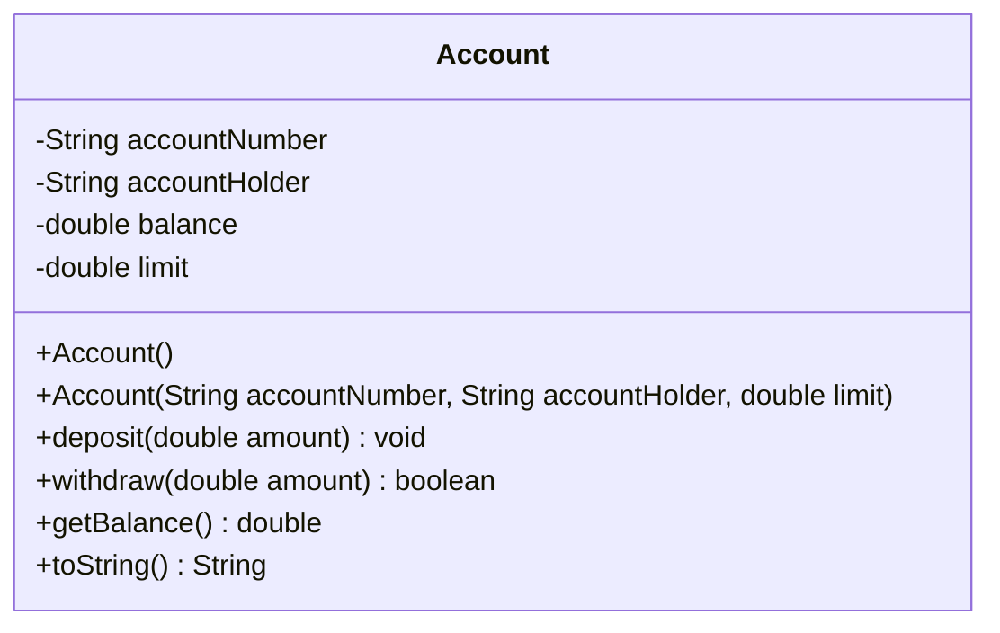

```mermaid
classDiagram
    class Account {
        -String accountNumber
        -String accountHolder
        -double balance
        -double limit
        +Account()
        +Account(String accountNumber, String accountHolder, double limit)
        +deposit(double amount) void
        +withdraw(double amount) boolean
        +getBalance() double
        +toString() String
    }
```
