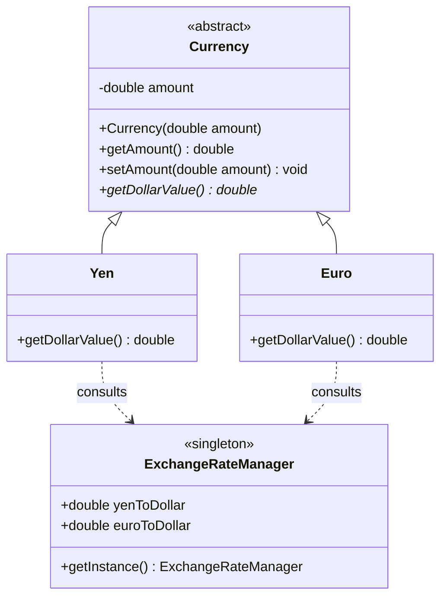

```mermaid
classDiagram
    class Currency {
        <<abstract>>
        -double amount
        +Currency(double amount)
        +getAmount() double
        +setAmount(double amount) void
        +getDollarValue()* double
    }
    class Yen {
        +getDollarValue() double
    }
    class Euro {
        +getDollarValue() double
    }
    class ExchangeRateManager {
        <<singleton>>
        +double yenToDollar
        +double euroToDollar
        +getInstance() ExchangeRateManager
    }

    Currency <|-- Yen
    Currency <|-- Euro
    Yen ..> ExchangeRateManager : consults
    Euro ..> ExchangeRateManager : consults
```
