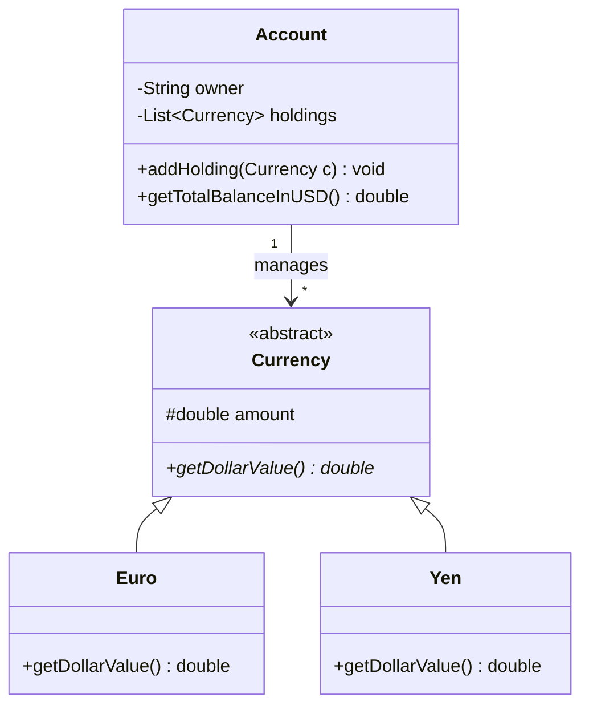

```mermaid
classDiagram
    direction TB
    class Currency {
        <<abstract>>
        #double amount
        +getDollarValue()* double
    }
    class Euro {
        +getDollarValue() double
    }
    class Yen {
        +getDollarValue() double
    }
    class Account {
        -String owner
        -List~Currency~ holdings
        +addHolding(Currency c) void
        +getTotalBalanceInUSD() double
    }

    Currency <|-- Euro
    Currency <|-- Yen
    Account "1" --> "*" Currency : manages
```
