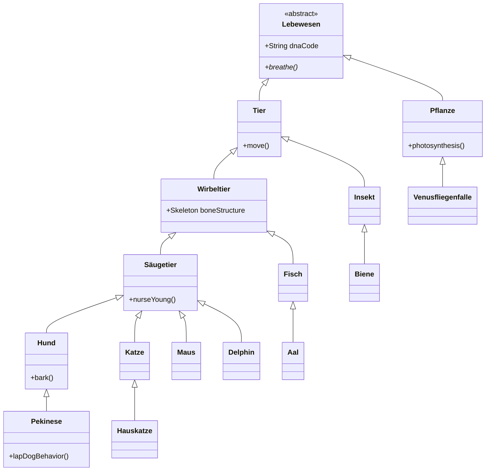

```mermaid
classDiagram
    direction TB
    class Lebewesen {
        <<abstract>>
        +String dnaCode
        +breathe()*
    }
    class Tier {
        +move()
    }
    class Pflanze {
        +photosynthesis()
    }
    class Wirbeltier {
        +Skeleton boneStructure
    }
    class Säugetier {
        +nurseYoung()
    }
    class Hund {
        +bark()
    }
    class Pekinese {
        +lapDogBehavior()
    }

    Lebewesen <|-- Tier
    Lebewesen <|-- Pflanze

    Tier <|-- Wirbeltier
    Tier <|-- Insekt

    Wirbeltier <|-- Säugetier
    Wirbeltier <|-- Fisch

    Insekt <|-- Biene
    Fisch <|-- Aal

    Säugetier <|-- Hund
    Säugetier <|-- Katze
    Säugetier <|-- Maus
    Säugetier <|-- Delphin

    Hund <|-- Pekinese
    Katze <|-- Hauskatze
    Pflanze <|-- Venusfliegenfalle
```
