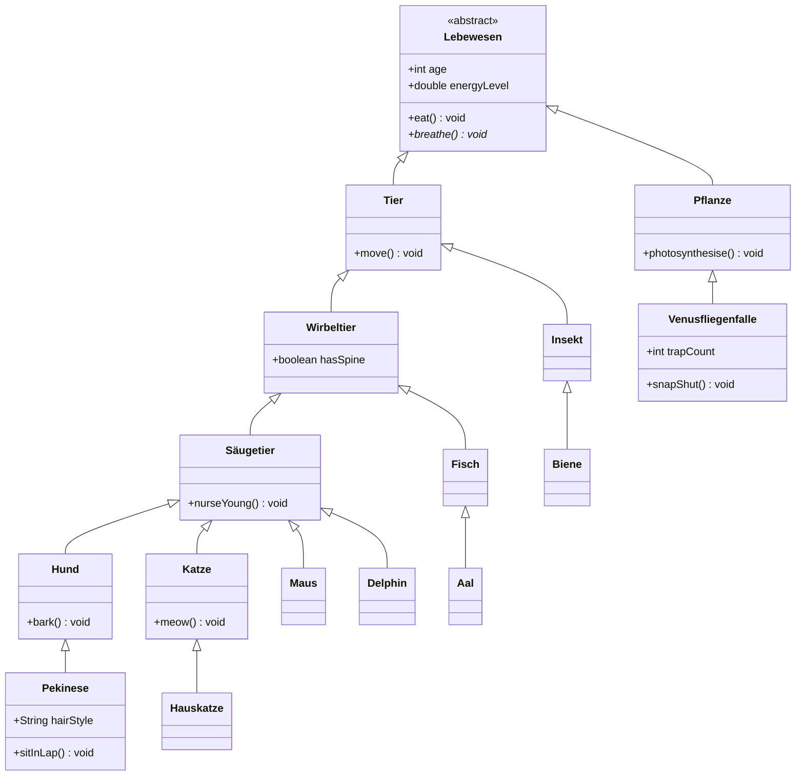

```mermaid
classDiagram
    direction TB
    class Lebewesen {
        <<abstract>>
        +int age
        +double energyLevel
        +eat() void
        +breathe()* void
    }
    class Tier {
        +move() void
    }
    class Pflanze {
        +photosynthesise() void
    }
    class Wirbeltier {
        +boolean hasSpine
    }
    class Säugetier {
        +nurseYoung() void
    }
    class Hund {
        +bark() void
    }
    class Pekinese {
        +String hairStyle
        +sitInLap() void
    }
    class Katze {
        +meow() void
    }
    class Venusfliegenfalle {
        +int trapCount
        +snapShut() void
    }

    Lebewesen <|-- Tier
    Lebewesen <|-- Pflanze
    
    Tier <|-- Wirbeltier
    Tier <|-- Insekt
    
    Wirbeltier <|-- Säugetier
    Wirbeltier <|-- Fisch
    
    Insekt <|-- Biene
    Fisch <|-- Aal
    
    Säugetier <|-- Hund
    Säugetier <|-- Katze
    Säugetier <|-- Maus
    Säugetier <|-- Delphin
    
    Hund <|-- Pekinese
    Katze <|-- Hauskatze
    Pflanze <|-- Venusfliegenfalle
```
