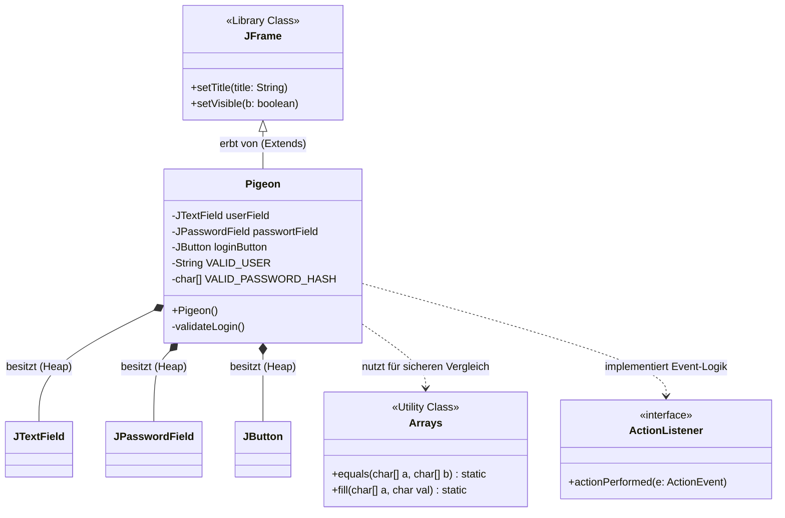

```mermaid
classDiagram
class JFrame {
<<Library Class>>
+setTitle(title: String)
+setVisible(b: boolean)
}

    class Pigeon {
        -JTextField userField
        -JPasswordField passwortField
        -JButton loginButton
        -String VALID_USER
        -char[] VALID_PASSWORD_HASH
        +Pigeon()
        -validateLogin()
    }

    class Arrays {
        <<Utility Class>>
        +equals(char[] a, char[] b) static
        +fill(char[] a, char val) static
    }

    class ActionListener {
        <<interface>>
        +actionPerformed(e: ActionEvent)
    }

    %% Beziehungen
    JFrame <|-- Pigeon : erbt von (Extends)
    Pigeon *-- JTextField : besitzt (Heap)
    Pigeon *-- JPasswordField : besitzt (Heap)
    Pigeon *-- JButton : besitzt (Heap)
    Pigeon ..> Arrays : nutzt für sicheren Vergleich
    Pigeon ..> ActionListener : implementiert Event-Logik
```