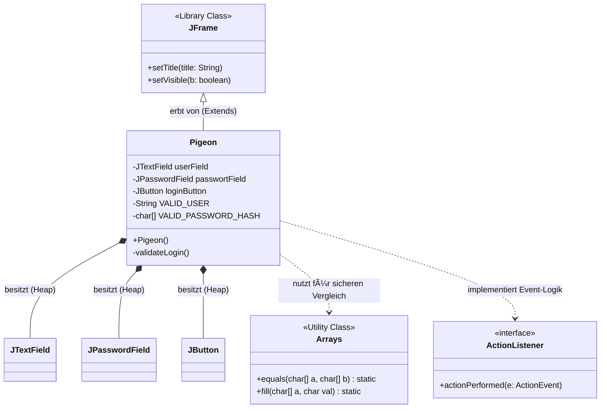

## Update of the model

## Delimitation of Model, View, Controller

## Pigeon publication sequence

## Pigeon System snapshot
taken right after you have imported a research dataset from a folder on your Mac.

a second snapshot is during the active publication phase. At this point, the system is in high gear: the 
CrosswalkManager has finished its work, a new OEMetadata object has been instantiated in memory, and the 
OEPConnector is actively transmitting data.

The final snapshot represents the terminal state of a successful publication cycle. At this point, 
the transient transformation objects have been cleared from memory (garbage collected), the project 
status has updated to reflect its permanent presence on the OEP, and the UI has returned to an idle, 
"Ready" state for the next task.

