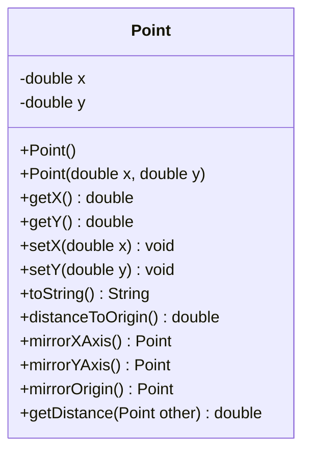

```mermaid
classDiagram
    class Point {
        -double x
        -double y
        +Point()
        +Point(double x, double y)
        +getX() double
        +getY() double
        +setX(double x) void
        +setY(double y) void
        +toString() String
        +distanceToOrigin() double
        +mirrorXAxis() Point
        +mirrorYAxis() Point
        +mirrorOrigin() Point
        +getDistance(Point other) double
    }
```
