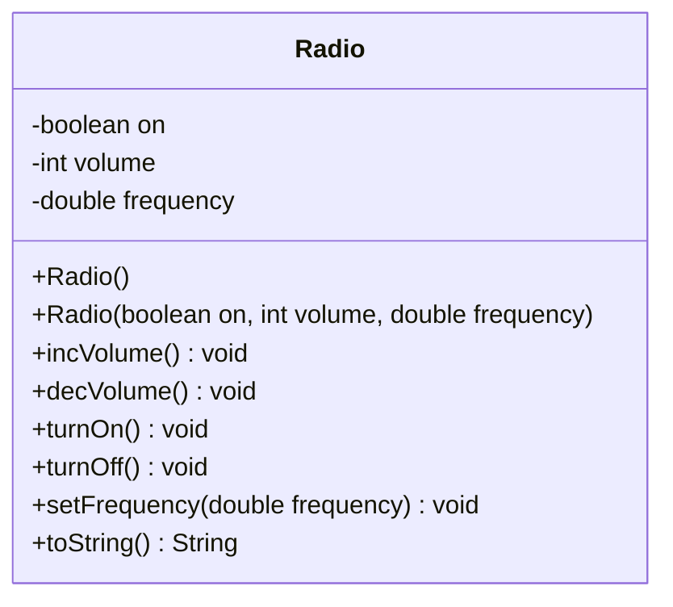

```mermaid
classDiagram
class Radio {
-boolean on
-int volume
-double frequency
+Radio()
+Radio(boolean on, int volume, double frequency)
+incVolume() void
+decVolume() void
+turnOn() void
+turnOff() void
+setFrequency(double frequency) void
+toString() String
}
```
