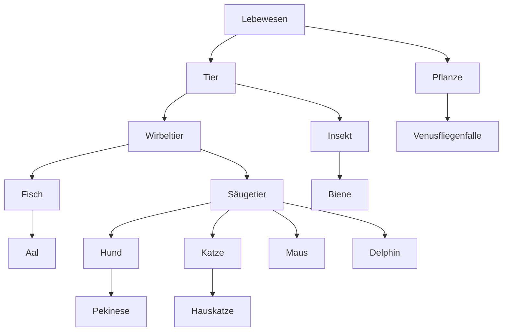

```mermaid
graph TD
    L[Lebewesen] --> T[Tier]
    L --> P[Pflanze]

    T --> W[Wirbeltier]
    T --> I[Insekt]

    W --> S[Säugetier]
    W --> F[Fisch]

    I --> B[Biene]
    
    F --> A[Aal]

    S --> H[Hund]
    S --> K[Katze]
    S --> M[Maus]
    S --> D[Delphin]

    H --> PE[Pekinese]
    K --> HK[Hauskatze]

    P --> V[Venusfliegenfalle]
```
